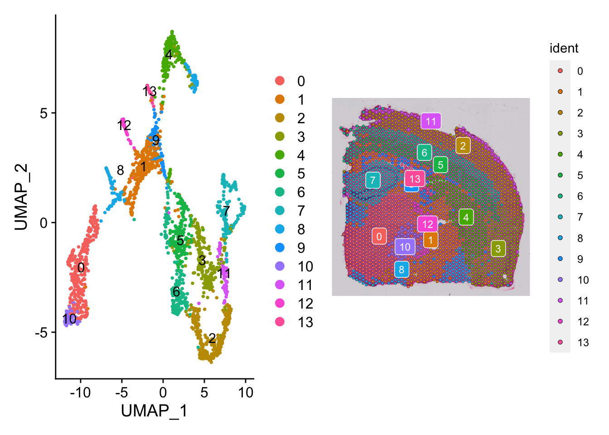
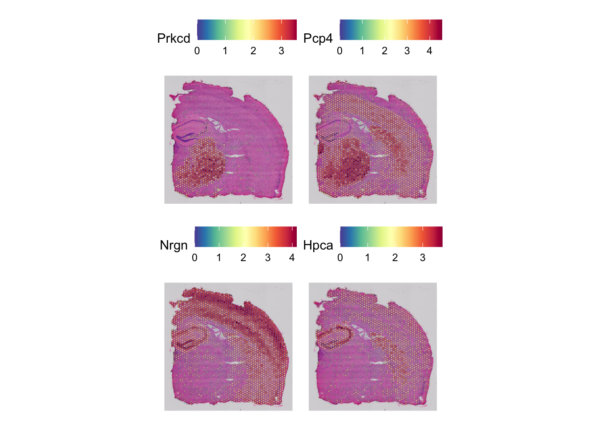
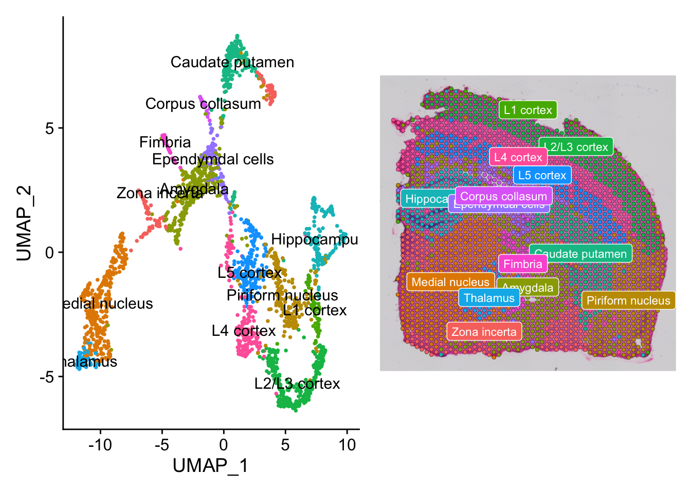

<h1>Spatial Transcriptomics Annotations</h1>

In this video, we are going to continue the spatial transcriptomics analysis where we will identify the gene markers that differentiate between different cell clusters and annotate the clusters. This is a critical step and requires biological knowledge. However, it is easier in spatial transcriptomics than in single cell RNAseq as we have the slide histology which gives us a hint about the cell cluster annotation.  
Let's start by loading the object from last video and reload the libraries: 

<h2>Load libraries and R object from last session</h2>
<pre>
  <code>
library(Seurat)
library(ggplot2)
library(patchwork)
library(dplyr)
slide1<-readRDS("slide1.rds")
  </code>
</pre>
<h2>Identify gene markers and annotate the cells</h2>
<pre>
  <code>
#start by inspecting the cell clusters and their spatial configuration on the histology slide
Idents(slide1)<-"seurat_clusters"
p1 <- DimPlot(slide1, reduction = "umap", label = TRUE)
p2 <- SpatialDimPlot(slide1, label = TRUE, label.size = 3)
p1 + p2
#identify markers
#we can identify markers using either one of two workflows. the first one uses 'FindMarkers' function which performs differential expression on pre-annotated region based on prior knowledge.
de_markers <- FindMarkers(slide1, ident.1 = 10, ident.2 = 7)
SpatialFeaturePlot(slide1, features = c("Prkcd", "Pcp4", "Nrgn", "Hpca"), alpha = c(0.1, 1))
#'de_markers' shows us the markers that differentiate between cluster 10 and 7, then we can annotate based on the markers of each region. In this case, cluster 10 expresses markers for thalamus while cluster 7 expresses markers for hippocampus.
#alternatively, seurat has 'FindSpatialVariableFeature' function that can search for features exhibiting spatial patterning but it requires intensive computation so make sure to run it on a computer cluster to avoid crashing.
#slide1 <- FindSpatiallyVariableFeatures(slide1, assay = "SCT", features = VariableFeatures(slide1)[1:1000], selection.method = "markvariogram")
  </code>
</pre>

<h2>Add a metadata column that contains the cluster annotations then plot the clusters </h2>
<pre>
  <code>
slide1$CellIdent <-("NA")
slide1$CellIdent[slide1$seurat_clusters==0]<-"Medial nucleus"
slide1$CellIdent[slide1$seurat_clusters==1]<-"Amygdala"
slide1$CellIdent[slide1$seurat_clusters==2]<-"L2/L3 cortex"
slide1$CellIdent[slide1$seurat_clusters==3]<-"Piriform nucleus"
slide1$CellIdent[slide1$seurat_clusters==4]<-"Caudate putamen"
slide1$CellIdent[slide1$seurat_clusters==5]<-"L5 cortex"
slide1$CellIdent[slide1$seurat_clusters==6]<-"L4 cortex"
slide1$CellIdent[slide1$seurat_clusters==7]<-"Hippocampus"
slide1$CellIdent[slide1$seurat_clusters==8]<-"Zona incerta"
slide1$CellIdent[slide1$seurat_clusters==9]<-"Ependymdal cells"
slide1$CellIdent[slide1$seurat_clusters==10]<-"Thalamus"
slide1$CellIdent[slide1$seurat_clusters==11]<-"L1 cortex"
slide1$CellIdent[slide1$seurat_clusters==12]<-"Fimbria"
slide1$CellIdent[slide1$seurat_clusters==13]<-"Corpus collasum"

#redo dimplots with the CellIdent instead of cluster number
Idents(slide1) <- "CellIdent"
p1 <- DimPlot(slide1, reduction = "umap", label = TRUE)
p2 <- SpatialDimPlot(slide1, label = TRUE, label.size = 3)
p1 + p2
  </code>
</pre>

