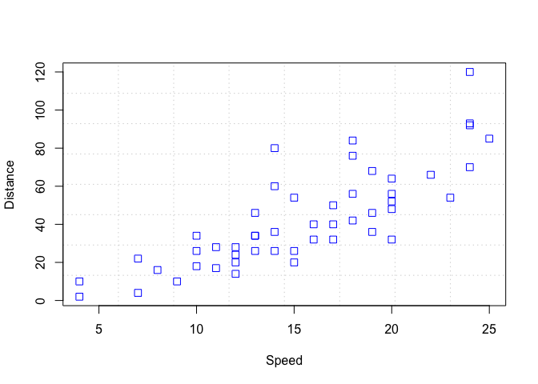
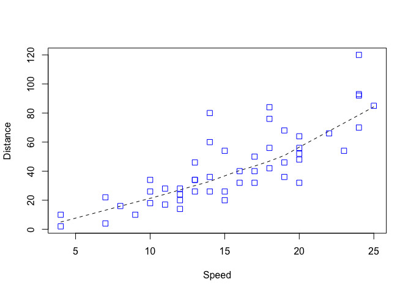
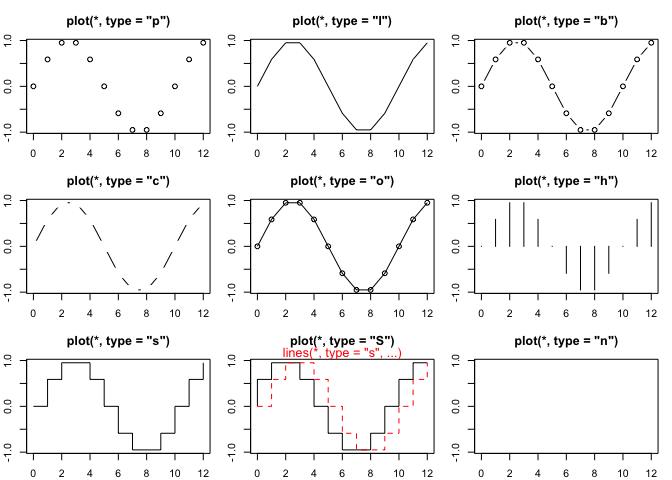
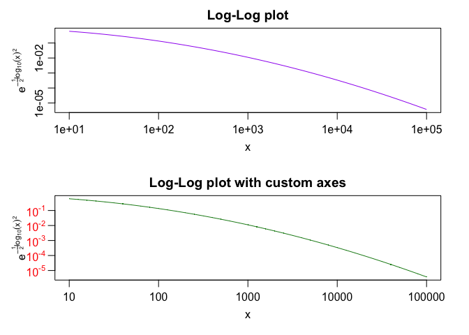

# Introduction to R

## Install R and RStudio

Install Rstudio from <https://rstudio.com/products/rstudio/> Create a
new project by going to file -\> New project -\> New directory -\> empty
project, choose a name and a location. Create a new script file file -\>
New file -\> R script N.B. the new created folder on your pc for this R
project is its default directory so to make things easier, copy the
files that you will be working on to this directory.

## Intro to R

link:<https://mothur.org/wiki/r_tutorial/>

## Introduction to the R environment

The R environment is a command line where you enter commands. When you
fire up R, you will see the following:

        R version 2.10.0 (2009-10-26)
        Copyright (C) 2009 The R Foundation for Statistical Computing
        ISBN 3-900051-07-0
        
        R is free software and comes with ABSOLUTELY NO WARRANTY.
        You are welcome to redistribute it under certain conditions.
        Type 'license()' or 'licence()' for distribution details.
        
          Natural language support but running in an English locale
        
        R is a collaborative project with many contributors.
        Type 'contributors()' for more information and
        'citation()' on how to cite R or R packages in publications.
        
        Type 'demo()' for some demos, 'help()' for on-line help, or
        'help.start()' for an HTML browser interface to help.
        Type 'q()' to quit R.

The “\>” is the prompt where you enter the commands. I will not be
putting the prompt in the tutorial. Let’s get started by entering the
following

``` r
2+2
```

    ## [1] 4

This output tells you the obvious result that 2+2 is 4. R can be used as
an over-grown calculator, but it is so much more than that. It’s really
a high level programming language to give you publication worthy
graphics and perform complex statistical analyses.

If you want to quit R, run the following:

    q()

You will encounter the follwing prompt:

    Save workspace image? [y/n/c]: 

If you select “y” then the next time you run R, it will recall your
previous commands.

    y

Fire up R again and hit the up arrow twice. You will see the following:

    > 2+2

As a short cut you can also type the following to get the same effect
when quitting R:

    q("yes")

Something to note as you go through the tutorial is the use of the pound
(\#) symbol. This indicates that what follows is a comment.  
For example:

``` r
2+2            #this is a comment
```

    ## [1] 4

Another useful feature is the inline help feature:

``` r
?mean
```

This will output a help file for the ‘mean’ function. You can scroll
through it with the arrow keys as well as the space bar. At the end of
the help text are one or more examples of how to use the function. You
can execute this example by copying and pasting the text. Alternatively,
you can use the ‘example’ command:

``` r
example(plot)
```

    ## 
    ## plot> Speed <- cars$speed
    ## 
    ## plot> Distance <- cars$dist
    ## 
    ## plot> plot(Speed, Distance, panel.first = grid(8, 8),
    ## plot+      pch = 0, cex = 1.2, col = "blue")



    ## 
    ## plot> plot(Speed, Distance,
    ## plot+      panel.first = lines(stats::lowess(Speed, Distance), lty = "dashed"),
    ## plot+      pch = 0, cex = 1.2, col = "blue")



    ## 
    ## plot> ## Show the different plot types
    ## plot> x <- 0:12
    ## 
    ## plot> y <- sin(pi/5 * x)
    ## 
    ## plot> op <- par(mfrow = c(3,3), mar = .1+ c(2,2,3,1))
    ## 
    ## plot> for (tp in c("p","l","b",  "c","o","h",  "s","S","n")) {
    ## plot+    plot(y ~ x, type = tp, main = paste0("plot(*, type = \"", tp, "\")"))
    ## plot+    if(tp == "S") {
    ## plot+       lines(x, y, type = "s", col = "red", lty = 2)
    ## plot+       mtext("lines(*, type = \"s\", ...)", col = "red", cex = 0.8)
    ## plot+    }
    ## plot+ }



    ## 
    ## plot> par(op)
    ## 
    ## plot> ##--- Log-Log Plot  with  custom axes
    ## plot> lx <- seq(1, 5, length = 41)
    ## 
    ## plot> yl <- expression(e^{-frac(1,2) * {log[10](x)}^2})
    ## 
    ## plot> y <- exp(-.5*lx^2)
    ## 
    ## plot> op <- par(mfrow = c(2,1), mar = par("mar")-c(1,0,2,0), mgp = c(2, .7, 0))
    ## 
    ## plot> plot(10^lx, y, log = "xy", type = "l", col = "purple",
    ## plot+      main = "Log-Log plot", ylab = yl, xlab = "x")

    ## 
    ## plot> plot(10^lx, y, log = "xy", type = "o", pch = ".", col = "forestgreen",
    ## plot+      main = "Log-Log plot with custom axes", ylab = yl, xlab = "x",
    ## plot+      axes = FALSE, frame.plot = TRUE)



    ## 
    ## plot> my.at <- 10^(1:5)
    ## 
    ## plot> axis(1, at = my.at, labels = formatC(my.at, format = "fg"))
    ## 
    ## plot> e.y <- -5:-1 ; at.y <- 10^e.y
    ## 
    ## plot> axis(2, at = at.y, col.axis = "red", las = 1,
    ## plot+      labels = as.expression(lapply(e.y, function(E) bquote(10^.(E)))))
    ## 
    ## plot> par(op)

Not sure what the function is that you want? Use the ‘??’ function…

``` r
??pca
```

This will tell you the list of functions and packages that have some
reference to “pca”.

Running “2+2” gets you the answer of “4”. But what if you want to store
that value? Save it as a variable…

``` r
x <- 2+2

# or
x = 2+2
x
```

    ## [1] 4

The left arrow is the preferred method of assigning values to variables.

Now you can manipulate that variable:

``` r
x + 2
```

    ## [1] 6

You can run two commands on the same line by separating the commands
with a semicolon:

``` r
x<-2+2;x+2
```

    ## [1] 6

To see what variables have been declared:

``` r
ls()
```

    ##  [1] "at.y"     "Distance" "e.y"      "lx"       "my.at"    "op"      
    ##  [7] "Speed"    "tp"       "x"        "y"        "yl"

To remove variables you no longer need:

``` r
rm(x)
```

Combining the last two commands will remove all of the variables stored
in memory:

``` r
rm(list=ls())
ls()
```

    ## character(0)

To keep our examples relevant, let’s quickly discuss how to read in a
table.  
The frist two commands below are not necessarily needed if you know you
are in the same folder as your data

``` r
getwd()                            # is this the directory we want to be in?
```

    ## [1] "/Users/mohamednoureldein/Desktop/BEC/3-R-Intro"

``` r
setwd("~/Desktop/BEC/3-R-intro")         # if not let's change directories
seq1 <- read.csv(file="GEO_table.csv", header=T)
```

The read.table command will read in your data table and keep the column
headings.  
These data represent the length of sequece in the Costello stool dataset
after removing primers, barcodes, and low quality bases. To make the
data easier to manipulate you can do the following:

``` r
head(seq1)  # inspect the first few lines of the file
```

    ##   X          ID           Gene.Symbol    logFC   AveExpr         t      P.Value
    ## 1 1 202238_s_at LOC101928916 /// NNMT 2.371518 0.5244777 11.797666 2.834754e-18
    ## 2 2 202018_s_at                   LTF 3.572012 0.7840189 10.461098 6.250055e-16
    ## 3 3   206336_at                 CXCL6 3.010190 0.7584136 10.019281 3.868041e-15
    ## 4 4   205987_at                  CD1C 1.106286 0.2163170  9.699914 1.459161e-14
    ## 5 5 219607_s_at                MS4A4A 1.905744 0.4073338  9.693370 1.499522e-14
    ## 6 6   204259_at                  MMP7 2.587143 0.3098049  9.378506 5.592862e-14
    ##      adj.P.Val        B
    ## 1 6.314981e-14 30.70919
    ## 2 6.961624e-12 25.61763
    ## 3 2.872279e-11 23.88935
    ## 4 6.680970e-11 22.62819
    ## 5 6.680970e-11 22.60226
    ## 6 2.076537e-10 21.35015

``` r
colnames(seq1)        # see the column heading names
```

    ## [1] "X"           "ID"          "Gene.Symbol" "logFC"       "AveExpr"    
    ## [6] "t"           "P.Value"     "adj.P.Val"   "B"

``` r
seq1$B[1:10]    # get the column "B" out of the table
```

    ##  [1] 30.70919 25.61763 23.88935 22.62819 22.60226 21.35015 20.43614 20.07680
    ##  [9] 19.18335 19.11775

``` r
attach(seq1)          # "attach" the table so that you don't need the "$"
B[1:10]
```

    ##  [1] 30.70919 25.61763 23.88935 22.62819 22.60226 21.35015 20.43614 20.07680
    ##  [9] 19.18335 19.11775

Don’t worry if you don’t understand everything in the last several
lines. The important thing is to see that there are different ways to
get the same output.

## Variables

Technically speaking everything in R is an object. That may be a bit
into the weeds for most people. But try to keep up. There are many types
of objects in R. We’ll start with these:  
\* Numeric values  
\* Character values  
\* Logical values  
\* Vectors  
\* Matrices

### Numeric Values

``` r
# The variable we used above, x, is a numeric value.  Here are some other examples:
x <- 2/3; x
```

    ## [1] 0.6666667

``` r
y <- 31.7
z <- 2.1e7                         # same as 2.1*10^7
longAndSilly.variable.name <- pi/3 # an example of a long variable name
```

Although it is a matter of personal style, ideally, your variable names
will have some meaning to you. For example:

``` r
genomeSize <- 4.5e6
#16SCopyNumber <- 6           # illegal variable name
rrnCopyNumber <- 6
```

A wide variety of arithmetic functions can be applied to these types of
variables:

``` r
log(x)           # natural logarithm
```

    ## [1] -0.4054651

``` r
log2(x)          # base 2 logarithm
```

    ## [1] -0.5849625

``` r
log10(x)         # base 10 logarithm
```

    ## [1] -0.1760913

``` r
exp(x)           # exponent
```

    ## [1] 1.947734

``` r
sqrt(x)          # square root
```

    ## [1] 0.8164966

``` r
abs(x)           # absolute value
```

    ## [1] 0.6666667

``` r
floor(x)         # the largest integers not greater than x
```

    ## [1] 0

``` r
ceiling(x)       # the smallest integers not less than x
```

    ## [1] 1

``` r
x %% 2           # remainder or modulo operator
```

    ## [1] 0.6666667

### Character values

``` r
#  Strings of character values are useful for storing text information

A <- "Alanine"; A
```

    ## [1] "Alanine"

``` r
R <- "Argenine"; R
```

    ## [1] "Argenine"

``` r
N <- "Asparagine"; N
```

    ## [1] "Asparagine"

The paste function is useful for converting numerical information into a
string:

``` r
x<-3.14159
text<-paste("x=", x, " y=", y, sep="")
text
```

    ## [1] "x=3.14159 y=31.7"

``` r
#  or
text<-paste("x=", format(x, digits=3), " y=", y, sep="")
text
```

    ## [1] "x=3.14 y=31.7"

### Logical values

``` r
#  Logical variables can have one of two values - TRUE or FALSE
x <- TRUE
y <- FALSE
!x              # NOT operator 
```

    ## [1] FALSE

``` r
x && y          # AND operator 
```

    ## [1] FALSE

``` r
x & y           # bitwise AND operator (mainly for vectors) 
```

    ## [1] FALSE

``` r
x || y          # OR operator 
```

    ## [1] TRUE

``` r
x | y          # bitwise OR operator (mainly for vectors) 
```

    ## [1] TRUE

``` r
x == y          # is equal operator 
```

    ## [1] FALSE

``` r
x != y          # is not equal operator
```

    ## [1] TRUE

We can also perform logical operators on numerical variables:

``` r
x <- 5
y <- 3

x > y          # greater than operator
```

    ## [1] TRUE

``` r
x >= y         # greater than or equal to operator
```

    ## [1] TRUE

``` r
x < y          # less than operator
```

    ## [1] FALSE

``` r
x <= y         # less than  or equal tooperator
```

    ## [1] FALSE

``` r
x == y         # is equal to operator
```

    ## [1] FALSE

``` r
x != y         # is not equal to operator
```

    ## [1] TRUE

We can also convert numerical values to logical values:

``` r
x <- 0
as.logical(x)
```

    ## [1] FALSE

``` r
as.logical(y)
```

    ## [1] TRUE

We can also use logical operators on strings:

``` r
x <- "ATG"
y <- "CCC"

x > y          # greater than operator
```

    ## [1] FALSE

``` r
x >= y         # greater than or equal to operator
```

    ## [1] FALSE

``` r
x < y          # less than operator
```

    ## [1] TRUE

``` r
x <= y         # less than  or equal tooperator
```

    ## [1] TRUE

``` r
x == y         # is equal to operator
```

    ## [1] FALSE

``` r
x != y         # is not equal to operator
```

    ## [1] TRUE

### Vectors

Vectors are a one-dimensional set of values of the same type. You can
read in vectors from a file or create them on the fly. Here are several
examples:

``` r
19:55                   # list the values from 19 to 55 by ones
```

    ##  [1] 19 20 21 22 23 24 25 26 27 28 29 30 31 32 33 34 35 36 37 38 39 40 41 42 43
    ## [26] 44 45 46 47 48 49 50 51 52 53 54 55

``` r
c(1,2,3,4)              # concatenate 1, 2, 3, 4, 5 into a vector
```

    ## [1] 1 2 3 4

``` r
rep("red", 5)           # repeat "red" five times
```

    ## [1] "red" "red" "red" "red" "red"

``` r
seq(1,10,by=3)          # list the values from 1 to 10 by 3's
```

    ## [1]  1  4  7 10

``` r
seq(1,10,length.out=20) # list 20 evenly spaced elements from 1 to 10
```

    ##  [1]  1.000000  1.473684  1.947368  2.421053  2.894737  3.368421  3.842105
    ##  [8]  4.315789  4.789474  5.263158  5.736842  6.210526  6.684211  7.157895
    ## [15]  7.631579  8.105263  8.578947  9.052632  9.526316 10.000000

``` r
seq(1,10,len=20)        # same thing; arguments of any function can be 
```

    ##  [1]  1.000000  1.473684  1.947368  2.421053  2.894737  3.368421  3.842105
    ##  [8]  4.315789  4.789474  5.263158  5.736842  6.210526  6.684211  7.157895
    ## [15]  7.631579  8.105263  8.578947  9.052632  9.526316 10.000000

``` r
                        # abbreviated as long as the abbreviation is unique
```

These can be combined as well:

``` r
c(rep("red", 5), rep("white", 5), rep("blue", 5))
```

    ##  [1] "red"   "red"   "red"   "red"   "red"   "white" "white" "white" "white"
    ## [10] "white" "blue"  "blue"  "blue"  "blue"  "blue"

``` r
rep(c(0,1), 10)
```

    ##  [1] 0 1 0 1 0 1 0 1 0 1 0 1 0 1 0 1 0 1 0 1

And they can be assigned to variables:

``` r
x <- seq(1,100,by=0.5)
x
```

    ##   [1]   1.0   1.5   2.0   2.5   3.0   3.5   4.0   4.5   5.0   5.5   6.0   6.5
    ##  [13]   7.0   7.5   8.0   8.5   9.0   9.5  10.0  10.5  11.0  11.5  12.0  12.5
    ##  [25]  13.0  13.5  14.0  14.5  15.0  15.5  16.0  16.5  17.0  17.5  18.0  18.5
    ##  [37]  19.0  19.5  20.0  20.5  21.0  21.5  22.0  22.5  23.0  23.5  24.0  24.5
    ##  [49]  25.0  25.5  26.0  26.5  27.0  27.5  28.0  28.5  29.0  29.5  30.0  30.5
    ##  [61]  31.0  31.5  32.0  32.5  33.0  33.5  34.0  34.5  35.0  35.5  36.0  36.5
    ##  [73]  37.0  37.5  38.0  38.5  39.0  39.5  40.0  40.5  41.0  41.5  42.0  42.5
    ##  [85]  43.0  43.5  44.0  44.5  45.0  45.5  46.0  46.5  47.0  47.5  48.0  48.5
    ##  [97]  49.0  49.5  50.0  50.5  51.0  51.5  52.0  52.5  53.0  53.5  54.0  54.5
    ## [109]  55.0  55.5  56.0  56.5  57.0  57.5  58.0  58.5  59.0  59.5  60.0  60.5
    ## [121]  61.0  61.5  62.0  62.5  63.0  63.5  64.0  64.5  65.0  65.5  66.0  66.5
    ## [133]  67.0  67.5  68.0  68.5  69.0  69.5  70.0  70.5  71.0  71.5  72.0  72.5
    ## [145]  73.0  73.5  74.0  74.5  75.0  75.5  76.0  76.5  77.0  77.5  78.0  78.5
    ## [157]  79.0  79.5  80.0  80.5  81.0  81.5  82.0  82.5  83.0  83.5  84.0  84.5
    ## [169]  85.0  85.5  86.0  86.5  87.0  87.5  88.0  88.5  89.0  89.5  90.0  90.5
    ## [181]  91.0  91.5  92.0  92.5  93.0  93.5  94.0  94.5  95.0  95.5  96.0  96.5
    ## [193]  97.0  97.5  98.0  98.5  99.0  99.5 100.0

``` r
code <- c("A", "T", "G", "C")
```

Note that in contrast to many programming languages, vectors in R are
indexed such that the first value is 1 NOT 0.

``` r
code[2]
```

    ## [1] "T"

``` r
code[0]
```

    ## character(0)

``` r
code[-1]
```

    ## [1] "T" "G" "C"

``` r
code[c(1,2)]
```

    ## [1] "A" "T"

Recall that we’ve already seen vectors in the preamble to this tutorial…

``` r
B[1:10]
```

    ##  [1] 30.70919 25.61763 23.88935 22.62819 22.60226 21.35015 20.43614 20.07680
    ##  [9] 19.18335 19.11775

You can easily determine the length of a vector

``` r
length(code)
```

    ## [1] 4

``` r
code[length(code)]
```

    ## [1] "C"

``` r
length(B)
```

    ## [1] 22277

Logical operators can also be used on vectors…

``` r
tf <- x > 50
isLong <- B > 200    # do you know what this is doing?
```

And used to select portions of vectors

``` r
x[tf]
```

    ##   [1]  50.5  51.0  51.5  52.0  52.5  53.0  53.5  54.0  54.5  55.0  55.5  56.0
    ##  [13]  56.5  57.0  57.5  58.0  58.5  59.0  59.5  60.0  60.5  61.0  61.5  62.0
    ##  [25]  62.5  63.0  63.5  64.0  64.5  65.0  65.5  66.0  66.5  67.0  67.5  68.0
    ##  [37]  68.5  69.0  69.5  70.0  70.5  71.0  71.5  72.0  72.5  73.0  73.5  74.0
    ##  [49]  74.5  75.0  75.5  76.0  76.5  77.0  77.5  78.0  78.5  79.0  79.5  80.0
    ##  [61]  80.5  81.0  81.5  82.0  82.5  83.0  83.5  84.0  84.5  85.0  85.5  86.0
    ##  [73]  86.5  87.0  87.5  88.0  88.5  89.0  89.5  90.0  90.5  91.0  91.5  92.0
    ##  [85]  92.5  93.0  93.5  94.0  94.5  95.0  95.5  96.0  96.5  97.0  97.5  98.0
    ##  [97]  98.5  99.0  99.5 100.0

One of the awesome things about vectors is that you can perform
algebraic manipulations on them. These types of operations are
“elementwise” meaning that the operation is applied to each operation

``` r
2 * x
```

    ##   [1]   2   3   4   5   6   7   8   9  10  11  12  13  14  15  16  17  18  19
    ##  [19]  20  21  22  23  24  25  26  27  28  29  30  31  32  33  34  35  36  37
    ##  [37]  38  39  40  41  42  43  44  45  46  47  48  49  50  51  52  53  54  55
    ##  [55]  56  57  58  59  60  61  62  63  64  65  66  67  68  69  70  71  72  73
    ##  [73]  74  75  76  77  78  79  80  81  82  83  84  85  86  87  88  89  90  91
    ##  [91]  92  93  94  95  96  97  98  99 100 101 102 103 104 105 106 107 108 109
    ## [109] 110 111 112 113 114 115 116 117 118 119 120 121 122 123 124 125 126 127
    ## [127] 128 129 130 131 132 133 134 135 136 137 138 139 140 141 142 143 144 145
    ## [145] 146 147 148 149 150 151 152 153 154 155 156 157 158 159 160 161 162 163
    ## [163] 164 165 166 167 168 169 170 171 172 173 174 175 176 177 178 179 180 181
    ## [181] 182 183 184 185 186 187 188 189 190 191 192 193 194 195 196 197 198 199
    ## [199] 200

``` r
x + x
```

    ##   [1]   2   3   4   5   6   7   8   9  10  11  12  13  14  15  16  17  18  19
    ##  [19]  20  21  22  23  24  25  26  27  28  29  30  31  32  33  34  35  36  37
    ##  [37]  38  39  40  41  42  43  44  45  46  47  48  49  50  51  52  53  54  55
    ##  [55]  56  57  58  59  60  61  62  63  64  65  66  67  68  69  70  71  72  73
    ##  [73]  74  75  76  77  78  79  80  81  82  83  84  85  86  87  88  89  90  91
    ##  [91]  92  93  94  95  96  97  98  99 100 101 102 103 104 105 106 107 108 109
    ## [109] 110 111 112 113 114 115 116 117 118 119 120 121 122 123 124 125 126 127
    ## [127] 128 129 130 131 132 133 134 135 136 137 138 139 140 141 142 143 144 145
    ## [145] 146 147 148 149 150 151 152 153 154 155 156 157 158 159 160 161 162 163
    ## [163] 164 165 166 167 168 169 170 171 172 173 174 175 176 177 178 179 180 181
    ## [181] 182 183 184 185 186 187 188 189 190 191 192 193 194 195 196 197 198 199
    ## [199] 200

``` r
log(x)
```

    ##   [1] 0.0000000 0.4054651 0.6931472 0.9162907 1.0986123 1.2527630 1.3862944
    ##   [8] 1.5040774 1.6094379 1.7047481 1.7917595 1.8718022 1.9459101 2.0149030
    ##  [15] 2.0794415 2.1400662 2.1972246 2.2512918 2.3025851 2.3513753 2.3978953
    ##  [22] 2.4423470 2.4849066 2.5257286 2.5649494 2.6026897 2.6390573 2.6741486
    ##  [29] 2.7080502 2.7408400 2.7725887 2.8033604 2.8332133 2.8622009 2.8903718
    ##  [36] 2.9177707 2.9444390 2.9704145 2.9957323 3.0204249 3.0445224 3.0680529
    ##  [43] 3.0910425 3.1135153 3.1354942 3.1570004 3.1780538 3.1986731 3.2188758
    ##  [50] 3.2386785 3.2580965 3.2771447 3.2958369 3.3141860 3.3322045 3.3499041
    ##  [57] 3.3672958 3.3843903 3.4011974 3.4177267 3.4339872 3.4499875 3.4657359
    ##  [64] 3.4812401 3.4965076 3.5115454 3.5263605 3.5409593 3.5553481 3.5695327
    ##  [71] 3.5835189 3.5973123 3.6109179 3.6243409 3.6375862 3.6506582 3.6635616
    ##  [78] 3.6763007 3.6888795 3.7013020 3.7135721 3.7256934 3.7376696 3.7495041
    ##  [85] 3.7612001 3.7727609 3.7841896 3.7954892 3.8066625 3.8177123 3.8286414
    ##  [92] 3.8394523 3.8501476 3.8607297 3.8712010 3.8815638 3.8918203 3.9019727
    ##  [99] 3.9120230 3.9219733 3.9318256 3.9415818 3.9512437 3.9608132 3.9702919
    ## [106] 3.9796817 3.9889840 3.9982007 4.0073332 4.0163830 4.0253517 4.0342406
    ## [113] 4.0430513 4.0517849 4.0604430 4.0690268 4.0775374 4.0859763 4.0943446
    ## [120] 4.1026434 4.1108739 4.1190372 4.1271344 4.1351666 4.1431347 4.1510399
    ## [127] 4.1588831 4.1666652 4.1743873 4.1820501 4.1896547 4.1972019 4.2046926
    ## [134] 4.2121276 4.2195077 4.2268337 4.2341065 4.2413268 4.2484952 4.2556127
    ## [141] 4.2626799 4.2696974 4.2766661 4.2835866 4.2904594 4.2972854 4.3040651
    ## [148] 4.3107991 4.3174881 4.3241327 4.3307333 4.3372907 4.3438054 4.3502779
    ## [155] 4.3567088 4.3630986 4.3694479 4.3757570 4.3820266 4.3882572 4.3944492
    ## [162] 4.4006030 4.4067192 4.4127983 4.4188406 4.4248466 4.4308168 4.4367515
    ## [169] 4.4426513 4.4485164 4.4543473 4.4601444 4.4659081 4.4716388 4.4773368
    ## [176] 4.4830026 4.4886364 4.4942386 4.4998097 4.5053499 4.5108595 4.5163390
    ## [183] 4.5217886 4.5272086 4.5325995 4.5379614 4.5432948 4.5485998 4.5538769
    ## [190] 4.5591262 4.5643482 4.5695430 4.5747110 4.5798524 4.5849675 4.5900565
    ## [197] 4.5951199 4.6001576 4.6051702

To define a vector without giving it any values

``` r
z <- numeric(5)             #  This creates a numerical vector with 5 zeros
z[3] <- 10
z
```

    ## [1]  0  0 10  0  0

``` r
z[1:3] <- 5
z
```

    ## [1] 5 5 5 0 0

``` r
z[10] <- pi

t <- character(5)
t[4] <- "DNA rocks!"
```

You can also create vectors that are indexed by character strings. In
some programming languages these are called hash-maps or look-up tables.

``` r
v <- numeric(0)
v["a"] <- 1.23498
v["t"] <- 2.2342
v["c"] <- 3
v["g"] <- 4
v
```

    ##       a       t       c       g 
    ## 1.23498 2.23420 3.00000 4.00000

You can get the name of each cell in the vector:

``` r
names(v)
```

    ## [1] "a" "t" "c" "g"

``` r
names(v) <- NULL  # this removes names attribute
v
```

    ## [1] 1.23498 2.23420 3.00000 4.00000

``` r
names(B) <- seq1$Gene.Symbol
B[1:10]
```

    ## LOC101928916 /// NNMT                   LTF                 CXCL6 
    ##              30.70919              25.61763              23.88935 
    ##                  CD1C                MS4A4A                  MMP7 
    ##              22.62819              22.60226              21.35015 
    ##                  CPA3                TRIM16                 CASP1 
    ##              20.43614              20.07680              19.18335 
    ##                FCER1A 
    ##              19.11775

Alternatively, we could define v2 as:

``` r
v2 <- c(A=1.23498,T=2.2342,C=3,G=4)
v2
```

    ##       A       T       C       G 
    ## 1.23498 2.23420 3.00000 4.00000

``` r
v2 * 2
```

    ##       A       T       C       G 
    ## 2.46996 4.46840 6.00000 8.00000

``` r
as.vector(v2)  # strips out names
```

    ## [1] 1.23498 2.23420 3.00000 4.00000

``` r
is.vector(v2)  # checks if v is a vector
```

    ## [1] TRUE

We can access elements of ‘v’ by their labels

    v2["a"]
    v2[["a"]]      # strips the name associated with value 1

There are many ways to get a value out of a vector. We’ve already seen
some of these

``` r
v <- floor(runif(10, 1,10)) # create a vector with 10 values randomly drawn from 
v                   # the range of 1 to 10
```

    ##  [1] 2 6 1 4 8 1 9 2 5 7

``` r
n <- 3
v[n]                # n-th element
```

    ## [1] 1

``` r
v[-n]               # all but the n-th element
```

    ## [1] 2 6 4 8 1 9 2 5 7

``` r
v[1:n]              # first n elements
```

    ## [1] 2 6 1

``` r
v[-(1:n)]           # elements from n+1 to the end
```

    ## [1] 4 8 1 9 2 5 7

``` r
v[c(2,4)]           # 2-nd and 4-th elements
```

    ## [1] 6 4

``` r
v["name"]           # element named "name"
```

    ## [1] NA

``` r
v[v > 6]            # elements greater than 6
```

    ## [1] 8 9 7

``` r
v[v > 4 & v < 6]    # elements between 4 and 6
```

    ## [1] 5

``` r
v[v %in% c(1,3,7)]  # elements in a given set
```

    ## [1] 1 1 7

``` r
v[!is.na(v)]        # subsequence of v consisting of non-missing values of v
```

    ##  [1] 2 6 1 4 8 1 9 2 5 7

``` r
v[is.na(v)] <- 0    # sets all missing values to 0
```

There are a variety of operators that take vectors as input

``` r
length(v)          # length of vector v
```

    ## [1] 10

``` r
mean(v)            # mean of v
```

    ## [1] 4.5

``` r
median(v)          # median of v
```

    ## [1] 4.5

``` r
sd(v)              # standard deviation of v
```

    ## [1] 2.953341

``` r
var(v)             # variance of v
```

    ## [1] 8.722222

``` r
mad(v)             # median absolute deviation of v
```

    ## [1] 3.7065

``` r
min(v)             # min of v
```

    ## [1] 1

``` r
max(v)             # maximal element of v
```

    ## [1] 9

``` r
which.min(v)       # returns the index of the smallest element of v
```

    ## [1] 3

``` r
which.max(v)       # returns the index of the greatest element of v
```

    ## [1] 7

``` r
summary(v)         # return descriptive statistics of v
```

    ##    Min. 1st Qu.  Median    Mean 3rd Qu.    Max. 
    ##    1.00    2.00    4.50    4.50    6.75    9.00

``` r
sum(v)             # sum of elements of v
```

    ## [1] 45

``` r
prod(v)            # product of all elements of v
```

    ## [1] 241920

``` r
sort(v)            # ascending sort the values of v
```

    ##  [1] 1 1 2 2 4 5 6 7 8 9

``` r
sort(v, decreasing=T)# descending sort the values of v
```

    ##  [1] 9 8 7 6 5 4 2 2 1 1

``` r
order(v)           # the order of the sorted values of v
```

    ##  [1]  3  6  1  8  4  9  2 10  5  7

``` r
v[order(v)]        # gives the same order as sort(v)
```

    ##  [1] 1 1 2 2 4 5 6 7 8 9

``` r
rev(v)             # reverse the order of v
```

    ##  [1] 7 5 2 9 1 8 4 1 6 2

``` r
unique(v)          # give the unique values of v
```

    ## [1] 2 6 1 4 8 9 5 7

``` r
all(v)             # returns TRUE if all values of a logical vector v are TRUE,
```

    ## Warning in all(v): coercing argument of type 'double' to logical

    ## [1] TRUE

``` r
                   # otherwise returns FALSE
any(v)             # returns TRUE if at least one value of a logical vector v is
```

    ## Warning in any(v): coercing argument of type 'double' to logical

    ## [1] TRUE

``` r
                   # TRUE, otherwise returns FALSE
```

### Exercises:

#### Calculate the following on the data we read in from the seq1 file:

1- number of genes  
2- number of genes with P.value\<0.05  
3- mean P.value  
4- median P.value  
5- standard deviation of P.value

Note that if a vector contains missing values then all above numerical
routines are going to return NA value. In order to skip missing values
of ‘v’ while computing some seq1 statistics of ‘v’, one can set na.rm to
TRUE as in the following example:

``` r
v <- floor(runif(10, 1,10)) 
v[11] = NA
mean(v)
```

    ## [1] NA

``` r
mean(v, na.rm=T)
```

    ## [1] 4.8

Say you want to search a character vector for a feature of the strings.
To do this you can use the grep function and its relatives to get the
indices of values in the vector that match the search:

``` r
shades.of.red <- grep("red", colors())
colors()[shades.of.red]
```

    ##  [1] "darkred"         "indianred"       "indianred1"      "indianred2"     
    ##  [5] "indianred3"      "indianred4"      "mediumvioletred" "orangered"      
    ##  [9] "orangered1"      "orangered2"      "orangered3"      "orangered4"     
    ## [13] "palevioletred"   "palevioletred1"  "palevioletred2"  "palevioletred3" 
    ## [17] "palevioletred4"  "red"             "red1"            "red2"           
    ## [21] "red3"            "red4"            "violetred"       "violetred1"     
    ## [25] "violetred2"      "violetred3"      "violetred4"

### Tables & Matrices

Tables and matrices are multi-dimensional sets of values of multiple or
the same type. We already read in a table in the preamble of this
tutorial…

``` r
getwd()                            # is this the directory we want to be in?
```

    ## [1] "/Users/mohamednoureldein/Desktop/BEC/3-R-Intro"

``` r
setwd("~/Desktop/BEC/3-R-intro")         # if not let's change directories
seq1 <- read.csv(file="GEO_table.csv", header=T)
```

Here “seq1” is a table of values describing some characteristics of the
sequences after removing the barcodes, primers, and low quality base
calls. Tables and matrices are indexed much like vectors…

``` r
seq1[1,1]             # get the name of the first sequence in the table
```

    ## [1] 1

``` r
seq1[1,c(1,4)]        # get the name and length of the first sequence 
```

    ##   X    logFC
    ## 1 1 2.371518

``` r
# seq1[1,]              # get all of the data in the first row
seq1[1,4]              # get all of the data in the column labelled "B"
```

    ## [1] 2.371518

``` r
# seq1[,"B"]       # get all of the data in the column labelled "B"
# seq1$B           # get all of the data in the column labelled "B"
# attach(seq1);B   # get all of the data in the column labelled "B"
detach(seq1)
```

It should be clear taht the last four commands above gave the same data.
With the exception of the first command, each of these commands returns
a vector.

When reading in a table it is always nice to get a handle of what you’re
working with…

``` r
dim(seq1)             # number of rows and columns in "seq1"
```

    ## [1] 22277     9

``` r
nrow(seq1)            # number of rows "seq1"
```

    ## [1] 22277

``` r
ncol(seq1)            # number of columns in "seq1"
```

    ## [1] 9

``` r
colnames(seq1)        # names of the columns in "seq1"
```

    ## [1] "X"           "ID"          "Gene.Symbol" "logFC"       "AveExpr"    
    ## [6] "t"           "P.Value"     "adj.P.Val"   "B"

``` r
# rownames(seq1)        # names of the rows in "seq1"
seq1[1:10,]           # get the first 10 rows of data from the "seq1" file
```

    ##     X          ID           Gene.Symbol     logFC   AveExpr         t
    ## 1   1 202238_s_at LOC101928916 /// NNMT 2.3715184 0.5244777 11.797666
    ## 2   2 202018_s_at                   LTF 3.5720123 0.7840189 10.461098
    ## 3   3   206336_at                 CXCL6 3.0101896 0.7584136 10.019281
    ## 4   4   205987_at                  CD1C 1.1062864 0.2163170  9.699914
    ## 5   5 219607_s_at                MS4A4A 1.9057437 0.4073338  9.693370
    ## 6   6   204259_at                  MMP7 2.5871433 0.3098049  9.378506
    ## 7   7   205624_at                  CPA3 2.1205714 0.4497262  9.149831
    ## 8   8   204341_at                TRIM16 0.9075934 0.1408630  9.060165
    ## 9   9 211366_x_at                 CASP1 1.1473888 0.2223426  8.837719
    ## 10 10 211734_s_at                FCER1A 1.3348138 0.2844784  8.821412
    ##         P.Value    adj.P.Val        B
    ## 1  2.834754e-18 6.314981e-14 30.70919
    ## 2  6.250055e-16 6.961624e-12 25.61763
    ## 3  3.868041e-15 2.872279e-11 23.88935
    ## 4  1.459161e-14 6.680970e-11 22.62819
    ## 5  1.499522e-14 6.680970e-11 22.60226
    ## 6  5.592862e-14 2.076537e-10 21.35015
    ## 7  1.460504e-13 4.647948e-10 20.43614
    ## 8  2.129595e-13 5.930124e-10 20.07680
    ## 9  5.436778e-13 1.297394e-09 19.18335
    ## 10 5.823918e-13 1.297394e-09 19.11775

Looking at the output from the ‘rownames’ command we know we can do
better than those row names. Let’s use the sequence names as the row
names…

``` r
rownames(seq1)<-seq1$seqname
seq1<-seq1[,-1]
seq1[1:10,]
```

    ##             ID           Gene.Symbol     logFC   AveExpr         t      P.Value
    ## 1  202238_s_at LOC101928916 /// NNMT 2.3715184 0.5244777 11.797666 2.834754e-18
    ## 2  202018_s_at                   LTF 3.5720123 0.7840189 10.461098 6.250055e-16
    ## 3    206336_at                 CXCL6 3.0101896 0.7584136 10.019281 3.868041e-15
    ## 4    205987_at                  CD1C 1.1062864 0.2163170  9.699914 1.459161e-14
    ## 5  219607_s_at                MS4A4A 1.9057437 0.4073338  9.693370 1.499522e-14
    ## 6    204259_at                  MMP7 2.5871433 0.3098049  9.378506 5.592862e-14
    ## 7    205624_at                  CPA3 2.1205714 0.4497262  9.149831 1.460504e-13
    ## 8    204341_at                TRIM16 0.9075934 0.1408630  9.060165 2.129595e-13
    ## 9  211366_x_at                 CASP1 1.1473888 0.2223426  8.837719 5.436778e-13
    ## 10 211734_s_at                FCER1A 1.3348138 0.2844784  8.821412 5.823918e-13
    ##       adj.P.Val        B
    ## 1  6.314981e-14 30.70919
    ## 2  6.961624e-12 25.61763
    ## 3  2.872279e-11 23.88935
    ## 4  6.680970e-11 22.62819
    ## 5  6.680970e-11 22.60226
    ## 6  2.076537e-10 21.35015
    ## 7  4.647948e-10 20.43614
    ## 8  5.930124e-10 20.07680
    ## 9  1.297394e-09 19.18335
    ## 10 1.297394e-09 19.11775

Let’s look at how we could get the row indices corresponding to B larger
than 10:

``` r
(1:length(B))[B > 10]
```

    ##  [1]  1  2  3  4  5  6  7  8  9 10 11 12 13 14 15 16 17 18 19 20 21 22 23 24 25
    ## [26] 26 27 28 29 30 31 32 33 34 35 36 37 38 39 40 41 42 43 44 45 46 47 48 49 50
    ## [51] 51 52 53 54 55 56 57 58 59 60 61 62 63 64 65 66 67 68 69 70 71 72 73 74 75
    ## [76] 76 77 78 79 80 81 82 83 84 85 86 87 88 89 90 91 92

To get the sequence names we could then do…

``` r
rownames(seq1)[(1:length(B))[B > 10]]  #wonky
```

    ##  [1] "1"  "2"  "3"  "4"  "5"  "6"  "7"  "8"  "9"  "10" "11" "12" "13" "14" "15"
    ## [16] "16" "17" "18" "19" "20" "21" "22" "23" "24" "25" "26" "27" "28" "29" "30"
    ## [31] "31" "32" "33" "34" "35" "36" "37" "38" "39" "40" "41" "42" "43" "44" "45"
    ## [46] "46" "47" "48" "49" "50" "51" "52" "53" "54" "55" "56" "57" "58" "59" "60"
    ## [61] "61" "62" "63" "64" "65" "66" "67" "68" "69" "70" "71" "72" "73" "74" "75"
    ## [76] "76" "77" "78" "79" "80" "81" "82" "83" "84" "85" "86" "87" "88" "89" "90"
    ## [91] "91" "92"

``` r
rownames(seq1)[seq1$B > 10]              #better
```

    ##  [1] "1"  "2"  "3"  "4"  "5"  "6"  "7"  "8"  "9"  "10" "11" "12" "13" "14" "15"
    ## [16] "16" "17" "18" "19" "20" "21" "22" "23" "24" "25" "26" "27" "28" "29" "30"
    ## [31] "31" "32" "33" "34" "35" "36" "37" "38" "39" "40" "41" "42" "43" "44" "45"
    ## [46] "46" "47" "48" "49" "50" "51" "52" "53" "54" "55" "56" "57" "58" "59" "60"
    ## [61] "61" "62" "63" "64" "65" "66" "67" "68" "69" "70" "71" "72" "73" "74" "75"
    ## [76] "76" "77" "78" "79" "80" "81" "82" "83" "84" "85" "86" "87" "88" "89" "90"
    ## [91] "91" "92"

Earlier we showed how to sort vectors. Let’s sort B by the largest
P.Value…

``` r
pOrder <- order(seq1$P.Value)
seq1[pOrder,c("P.Value", "B")][1:10,]
```

    ##         P.Value        B
    ## 1  2.834754e-18 30.70919
    ## 2  6.250055e-16 25.61763
    ## 3  3.868041e-15 23.88935
    ## 4  1.459161e-14 22.62819
    ## 5  1.499522e-14 22.60226
    ## 6  5.592862e-14 21.35015
    ## 7  1.460504e-13 20.43614
    ## 8  2.129595e-13 20.07680
    ## 9  5.436778e-13 19.18335
    ## 10 5.823918e-13 19.11775

You can see that’s not exactly what we were hoping for. We can actually
use the order command to sort on multiple columns…

``` r
BpOrder <- order(seq1$P.Value, seq1$B)
P.Value <- seq1[BpOrder,c("P.Value", "B")]
P.Value[1:10,]
```

    ##         P.Value        B
    ## 1  2.834754e-18 30.70919
    ## 2  6.250055e-16 25.61763
    ## 3  3.868041e-15 23.88935
    ## 4  1.459161e-14 22.62819
    ## 5  1.499522e-14 22.60226
    ## 6  5.592862e-14 21.35015
    ## 7  1.460504e-13 20.43614
    ## 8  2.129595e-13 20.07680
    ## 9  5.436778e-13 19.18335
    ## 10 5.823918e-13 19.11775

Let’s write the sorted P.Values to a new file

``` r
write(P.Value$B,file="pvalue.txt")
```

To read a vector in from a file…

``` r
pvalue <- scan("pvalue.txt")
```

Those two commands are for writing and reading vectors. If we wanted to
write and read a table we’d do the following…

``` r
write.table(P.Value,file="P.Values.txt", quote=F)
```

If you open P.Values.txt in a text editor you will see that there are
three columns of data, but only two headings. If you have one fewer
headings than columns, R will use the first column of data as the
rownames when you try to read it back in…

``` r
table<-read.table(file="P.Values.txt", header=T)
```

There are some functions that take matrices/tables as input:

``` r
m <- matrix(floor(runif(100, 1, 10)), nrow=10, ncol=10)    #create a 10 x 10 matrix
t(m)             # transpose the matrix
```

    ##       [,1] [,2] [,3] [,4] [,5] [,6] [,7] [,8] [,9] [,10]
    ##  [1,]    6    5    2    4    3    9    9    7    5     8
    ##  [2,]    8    1    5    7    9    8    6    3    6     6
    ##  [3,]    4    8    5    5    9    6    8    5    1     2
    ##  [4,]    6    6    9    1    8    7    8    5    5     4
    ##  [5,]    2    1    7    6    8    7    6    7    5     3
    ##  [6,]    5    8    9    9    5    9    8    8    2     9
    ##  [7,]    1    7    2    1    2    6    6    9    8     2
    ##  [8,]    1    8    3    7    8    7    9    7    2     9
    ##  [9,]    9    3    4    9    7    8    5    1    4     4
    ## [10,]    3    4    2    3    5    2    6    9    6     2

``` r
1/m              # take each value of m and find it's reciprocal
```

    ##            [,1]      [,2]      [,3]      [,4]      [,5]      [,6]      [,7]
    ##  [1,] 0.1666667 0.1250000 0.2500000 0.1666667 0.5000000 0.2000000 1.0000000
    ##  [2,] 0.2000000 1.0000000 0.1250000 0.1666667 1.0000000 0.1250000 0.1428571
    ##  [3,] 0.5000000 0.2000000 0.2000000 0.1111111 0.1428571 0.1111111 0.5000000
    ##  [4,] 0.2500000 0.1428571 0.2000000 1.0000000 0.1666667 0.1111111 1.0000000
    ##  [5,] 0.3333333 0.1111111 0.1111111 0.1250000 0.1250000 0.2000000 0.5000000
    ##  [6,] 0.1111111 0.1250000 0.1666667 0.1428571 0.1428571 0.1111111 0.1666667
    ##  [7,] 0.1111111 0.1666667 0.1250000 0.1250000 0.1666667 0.1250000 0.1666667
    ##  [8,] 0.1428571 0.3333333 0.2000000 0.2000000 0.1428571 0.1250000 0.1111111
    ##  [9,] 0.2000000 0.1666667 1.0000000 0.2000000 0.2000000 0.5000000 0.1250000
    ## [10,] 0.1250000 0.1666667 0.5000000 0.2500000 0.3333333 0.1111111 0.5000000
    ##            [,8]      [,9]     [,10]
    ##  [1,] 1.0000000 0.1111111 0.3333333
    ##  [2,] 0.1250000 0.3333333 0.2500000
    ##  [3,] 0.3333333 0.2500000 0.5000000
    ##  [4,] 0.1428571 0.1111111 0.3333333
    ##  [5,] 0.1250000 0.1428571 0.2000000
    ##  [6,] 0.1428571 0.1250000 0.5000000
    ##  [7,] 0.1111111 0.2000000 0.1666667
    ##  [8,] 0.1428571 1.0000000 0.1111111
    ##  [9,] 0.5000000 0.2500000 0.1666667
    ## [10,] 0.1111111 0.2500000 0.5000000

``` r
m * m            # calculate the square of each value in m
```

    ##       [,1] [,2] [,3] [,4] [,5] [,6] [,7] [,8] [,9] [,10]
    ##  [1,]   36   64   16   36    4   25    1    1   81     9
    ##  [2,]   25    1   64   36    1   64   49   64    9    16
    ##  [3,]    4   25   25   81   49   81    4    9   16     4
    ##  [4,]   16   49   25    1   36   81    1   49   81     9
    ##  [5,]    9   81   81   64   64   25    4   64   49    25
    ##  [6,]   81   64   36   49   49   81   36   49   64     4
    ##  [7,]   81   36   64   64   36   64   36   81   25    36
    ##  [8,]   49    9   25   25   49   64   81   49    1    81
    ##  [9,]   25   36    1   25   25    4   64    4   16    36
    ## [10,]   64   36    4   16    9   81    4   81   16     4

``` r
m %*% m          # performs matrix multiplication
```

    ##       [,1] [,2] [,3] [,4] [,5] [,6] [,7] [,8] [,9] [,10]
    ##  [1,]  244  257  214  247  202  300  203  236  256   171
    ##  [2,]  316  304  262  305  292  398  230  304  276   214
    ##  [3,]  260  301  274  274  276  358  199  304  292   183
    ##  [4,]  299  296  268  323  276  350  277  296  260   230
    ##  [5,]  331  354  344  371  343  464  288  390  324   273
    ##  [6,]  395  411  377  413  360  480  319  396  390   296
    ##  [7,]  412  421  376  416  374  523  304  422  392   296
    ##  [8,]  387  381  339  370  329  467  248  406  342   250
    ##  [9,]  269  261  245  252  207  312  186  293  245   187
    ## [10,]  305  282  260  282  248  352  247  284  270   218

``` r
crossprod(m,m)   # performs the cross product
```

    ##       [,1] [,2] [,3] [,4] [,5] [,6] [,7] [,8] [,9] [,10]
    ##  [1,]  390  343  303  339  294  430  282  379  310   250
    ##  [2,]  343  401  310  351  327  411  221  349  366   231
    ##  [3,]  303  310  341  338  289  397  234  359  293   229
    ##  [4,]  339  351  338  397  320  421  266  354  310   248
    ##  [5,]  294  327  289  320  322  379  232  326  284   231
    ##  [6,]  430  411  397  421  379  570  306  475  385   285
    ##  [7,]  282  221  234  266  232  306  280  279  188   229
    ##  [8,]  379  349  359  354  326  475  279  451  316   263
    ##  [9,]  310  366  293  310  284  385  188  316  358   196
    ## [10,]  250  231  229  248  231  285  229  263  196   224

``` r
rowSums(m)       # calculate the sum for each row
```

    ##  [1] 45 51 48 52 64 69 71 61 44 49

``` r
colSums(m)       # calculate the sum for each column
```

    ##  [1] 58 59 53 59 52 72 44 61 54 42

``` r
lower.tri(m)     # find the indices that are below the diagonal
```

    ##        [,1]  [,2]  [,3]  [,4]  [,5]  [,6]  [,7]  [,8]  [,9] [,10]
    ##  [1,] FALSE FALSE FALSE FALSE FALSE FALSE FALSE FALSE FALSE FALSE
    ##  [2,]  TRUE FALSE FALSE FALSE FALSE FALSE FALSE FALSE FALSE FALSE
    ##  [3,]  TRUE  TRUE FALSE FALSE FALSE FALSE FALSE FALSE FALSE FALSE
    ##  [4,]  TRUE  TRUE  TRUE FALSE FALSE FALSE FALSE FALSE FALSE FALSE
    ##  [5,]  TRUE  TRUE  TRUE  TRUE FALSE FALSE FALSE FALSE FALSE FALSE
    ##  [6,]  TRUE  TRUE  TRUE  TRUE  TRUE FALSE FALSE FALSE FALSE FALSE
    ##  [7,]  TRUE  TRUE  TRUE  TRUE  TRUE  TRUE FALSE FALSE FALSE FALSE
    ##  [8,]  TRUE  TRUE  TRUE  TRUE  TRUE  TRUE  TRUE FALSE FALSE FALSE
    ##  [9,]  TRUE  TRUE  TRUE  TRUE  TRUE  TRUE  TRUE  TRUE FALSE FALSE
    ## [10,]  TRUE  TRUE  TRUE  TRUE  TRUE  TRUE  TRUE  TRUE  TRUE FALSE

``` r
m[lower.tri(m)]  # give the lower triangle of m
```

    ##  [1] 5 2 4 3 9 9 7 5 8 5 7 9 8 6 3 6 6 5 9 6 8 5 1 2 8 7 8 5 5 4 7 6 7 5 3 8 8 2
    ## [39] 9 9 8 2 2 9 4

``` r
diag(m)          # the values on the diagonal of m
```

    ##  [1] 6 1 5 1 8 9 6 7 4 2

``` r
det(m)           # the determinent of m
```

    ## [1] 48338446

If you try to get the mean or standard deviation of a row or column
you’ll struggle mightilly with these commands. Instead you need to use
the “apply” command:

``` r
mean(m)
```

    ## [1] 5.54

``` r
apply(m, 1, mean)  # get the mean for each row (that's the 1)
```

    ##  [1] 4.5 5.1 4.8 5.2 6.4 6.9 7.1 6.1 4.4 4.9

``` r
apply(m, 2, mean)  # get the mean for each column (that's the 2)
```

    ##  [1] 5.8 5.9 5.3 5.9 5.2 7.2 4.4 6.1 5.4 4.2

``` r
apply(m, 1, sum)   # get the sum for each row - same as rowSums(m)
```

    ##  [1] 45 51 48 52 64 69 71 61 44 49

``` r
apply(m, 2, sum)   # get the sum for each column - same as colSums(m)
```

    ##  [1] 58 59 53 59 52 72 44 61 54 42

### Factors

Factors are categorical variables. The “seq1” table doesn’t exactly
contain any categorical data. For the purposes of discussion, let’s use
the Gene.Symbol column as a categorical data type. The important thing
is that factors have discrete levels. For example, in microbial ecology,
we might think of soil types, body sites, a person’s sex, or whether a
site is polluted as categorical variables.

Factors can be created using factor() routine.

``` r
seq1$Gene.Symbol <-factor(seq1$Gene.Symbol)
levels(seq1$Gene.Symbol)[1:10]
```

    ##  [1] ""       "A1CF"   "A2M"    "A4GALT" "A4GNT"  "AAAS"   "AACS"   "AADAC" 
    ##  [9] "AAGAB"  "AAK1"

If we wanted to convert our factors from factors to strings or to
numbers, we could do the following…

``` r
seq1$Gene.Symbol <- as.character(seq1$Gene.Symbol)
```

We might be interested to see if sequence length varies with the length
of the homopolymer in the sequence. We can do this with the `aggregate`
command and treating polymer as a factor…

``` r
attach(seq1)
```

    ## The following objects are masked _by_ .GlobalEnv:
    ## 
    ##     B, P.Value, t

``` r
aggregate(seq1$B, list(Gene.Symbol), mean)[1:10,]
```

    ##    Group.1         x
    ## 1          -5.574545
    ## 2     A1CF -6.181911
    ## 3      A2M -5.149030
    ## 4   A4GALT -6.326033
    ## 5    A4GNT -5.048817
    ## 6     AAAS -6.122145
    ## 7     AACS -6.467443
    ## 8    AADAC -4.597948
    ## 9    AAGAB -4.194705
    ## 10    AAK1 -5.902073

``` r
aggregate(seq1$B, list(Gene.Symbol), median)[1:10,]
```

    ##    Group.1         x
    ## 1          -6.075262
    ## 2     A1CF -6.181911
    ## 3      A2M -5.149030
    ## 4   A4GALT -6.326033
    ## 5    A4GNT -5.048817
    ## 6     AAAS -6.122145
    ## 7     AACS -6.467443
    ## 8    AADAC -4.597948
    ## 9    AAGAB -4.194705
    ## 10    AAK1 -5.962201

``` r
aggregate(seq1$B, list(Gene.Symbol), sd)[1:10,]
```

    ##    Group.1         x
    ## 1          1.2335022
    ## 2     A1CF        NA
    ## 3      A2M        NA
    ## 4   A4GALT        NA
    ## 5    A4GNT        NA
    ## 6     AAAS        NA
    ## 7     AACS        NA
    ## 8    AADAC        NA
    ## 9    AAGAB 1.5981851
    ## 10    AAK1 0.3849462

Similar to the aggregate command, the “by” command will allow you to
take all of the columns and perform an operation on the…

    by(seq1, seq1["Gene.Symbol"], summary)[1:10,]

## Programming basics

R is a pretty high-level programming language with extensive
functionality built in. The strength of R is that as a user you can add
to this to suit your needs.

### Customized functions

Want to make your own function or package? It’s relatively simple. The
general syntax is as follows:

``` r
functionName <- function(x){
       #the stuff goes here
}
```

So we might write a trivial script to calculate the square root of a
value.

``` r
my.sqrt<-function(x){
   sqrt(x)
}

my.values <- 1:10
my.sqrt(my.values)
```

    ##  [1] 1.000000 1.414214 1.732051 2.000000 2.236068 2.449490 2.645751 2.828427
    ##  [9] 3.000000 3.162278

The output of “my.sqrt(my.values)” should be the same as the following:

``` r
sqrt(1:10)
```

    ##  [1] 1.000000 1.414214 1.732051 2.000000 2.236068 2.449490 2.645751 2.828427
    ##  [9] 3.000000 3.162278

### for loops

If you want to do something to each value in a vector or to carry out
some procedure a specific number of times, you can do that with a for
loop.  
Let’s sum the square of all the numbers between 1 and 10:

``` r
for.sum <- 0;
for(i in 1:10){
   for.sum = for.sum + i^2
}
for.sum
```

    ## [1] 385

### If-then-else statements

When you meet a fork in the road, take it. Well, ok, maybe not, but in R
you can use logic statements to make decisions. For example, let’s
create a vector of factors to indicate if P.Value is significant or not:

``` r
significance <- numeric(nrow(seq1))

for ( i in 1:length(seq1$P.Value) ){

  if ( seq1$B[i] < 0.06 ){
    significance[i] <- "parially significant"
  }else if ( seq1$P.Value[i] < 0.05 ){
    significance[i] <- "significant"
  }else {
    significance[i] <- "non-significant"
  }
}

significance <- factor(significance)
significance[1:10]
```

    ##  [1] significant significant significant significant significant significant
    ##  [7] significant significant significant significant
    ## Levels: parially significant significant

Attach the significance column to the `seq1` table:

``` r
seq1$significance <- significance
head(seq1)
```

    ##            ID           Gene.Symbol    logFC   AveExpr         t      P.Value
    ## 1 202238_s_at LOC101928916 /// NNMT 2.371518 0.5244777 11.797666 2.834754e-18
    ## 2 202018_s_at                   LTF 3.572012 0.7840189 10.461098 6.250055e-16
    ## 3   206336_at                 CXCL6 3.010190 0.7584136 10.019281 3.868041e-15
    ## 4   205987_at                  CD1C 1.106286 0.2163170  9.699914 1.459161e-14
    ## 5 219607_s_at                MS4A4A 1.905744 0.4073338  9.693370 1.499522e-14
    ## 6   204259_at                  MMP7 2.587143 0.3098049  9.378506 5.592862e-14
    ##      adj.P.Val        B significance
    ## 1 6.314981e-14 30.70919  significant
    ## 2 6.961624e-12 25.61763  significant
    ## 3 2.872279e-11 23.88935  significant
    ## 4 6.680970e-11 22.62819  significant
    ## 5 6.680970e-11 22.60226  significant
    ## 6 2.076537e-10 21.35015  significant
